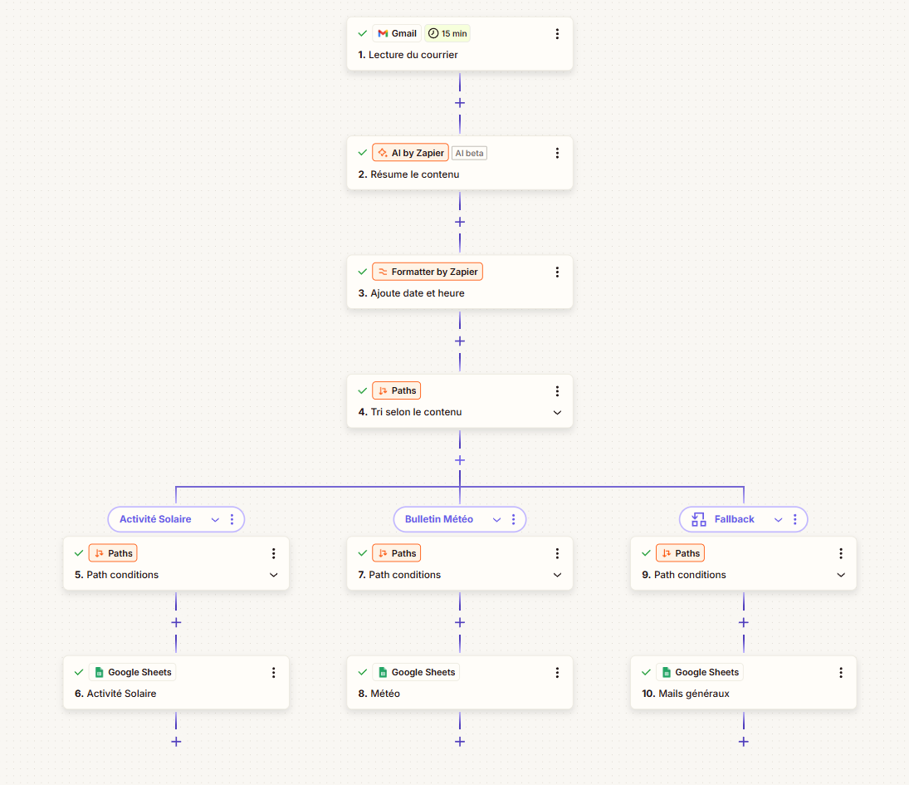
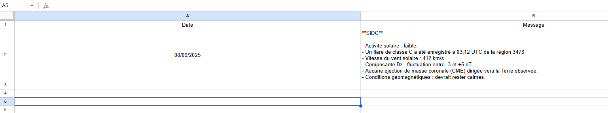
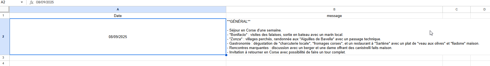
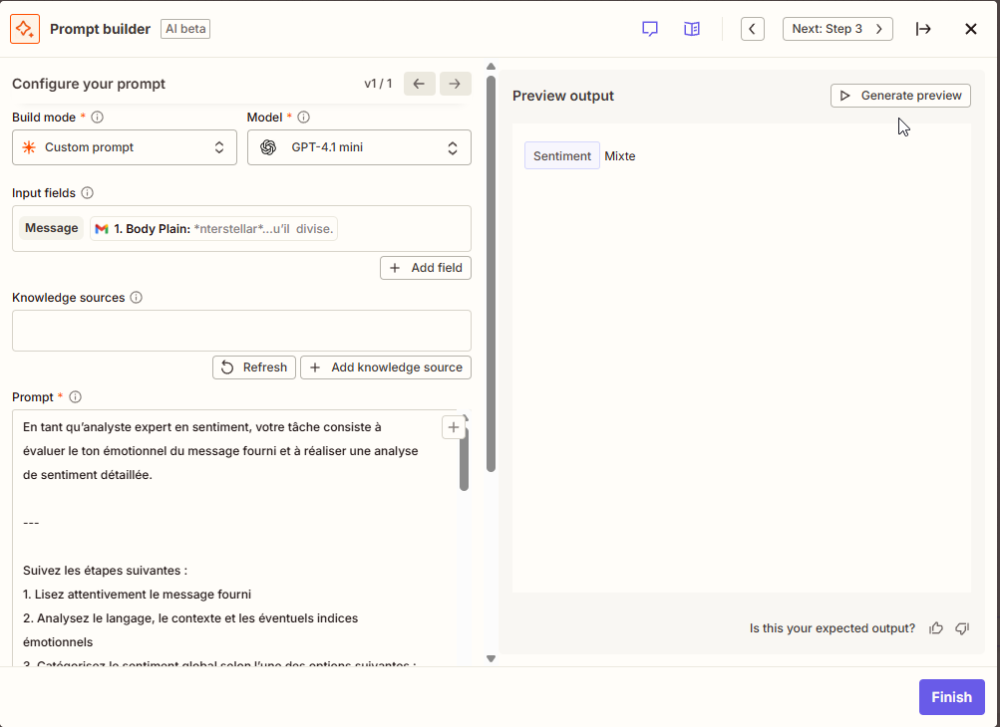

# ⚡ Zapier Showcase – Automatisations par IA



## Présentation

Ce dépôt présente **2 workflows Zapier** utilisant l’IA pour automatiser le traitement des emails.  
Objectif : démontrer la maîtrise de Zapier dans un cadre professionnel, avec intégration de l’IA, classification et archivage automatique.  

---

## 🔹 Workflow 1 – Tri & Résumé des Emails → Google Sheets


- **Trigger** : réception d’un email (Gmail).  
- **IA** : génération d’un résumé (Zapier AI).  
- **Formatter** : ajout de la date et de l’heure.  
- **Classification (Paths)** :  
  - Bulletin météo,  
  - Activité solaire (SIDC),  
  - Messages généraux.  
- **Sortie** : insertion du résumé dans le Google Sheet correspondant.  

### Exemples de rendus
-   
-   
-   

---

## 🔹 Workflow 2 – Analyse de Sentiments → Google Docs


- **Trigger** : réception d’un email (Gmail).  
- **IA** : analyse de sentiments (Positif, Négatif, Neutre, Mixte).  
- **Formatter** : ajout de la date et de l’heure.  
- **Classification (Paths)** : chaque catégorie redirige vers un document distinct.  
- **Sortie** : insertion dans le Google Doc correspondant, avec Date + Label de sentiment + Texte original.  

### Exemple de paramétrage
-   
-   

### Exemple de rendu
-   

---

## 💾 Arborescence

```
zapier_showcase/
├── README.md                          # Version en français
├── README_en.md                       # English version
│
├── analyse_sentiments/                # Workflow analyse de sentiments
│   ├── node_google_doc.png            # Détails paramétrage node Google Docs
│   ├── node_IA.png                    # Paramétrage node IA
│   ├── rendu.png                      # Exemple de texte classé avec label
│   ├── workflow.png                   # Vue générale du workflow
│   └── system_prompt.txt              # Prompt système du node IA
│
└── tri_resume/                        # Workflow tri & résumé d’emails
    ├── meteo.png                      # Exemple rendu météo
    ├── vacances.png                   # Exemple rendu vacances
    ├── SIDC.png                       # Exemple rendu activité solaire
    ├── node_IA.png                    # Paramétrage node IA
    ├── node_google_sheet.png          # Paramétrage node Google Sheets
    ├── workflow.png                   # Vue générale du workflow
    └── system_prompt.txt              # Prompt système du node IA
```

---

👉 Ces workflows ne sont pas fournis en blueprint Zapier (limitation de la version d’essai), mais les **captures d’écran et prompts** permettent de reproduire chaque étape.
