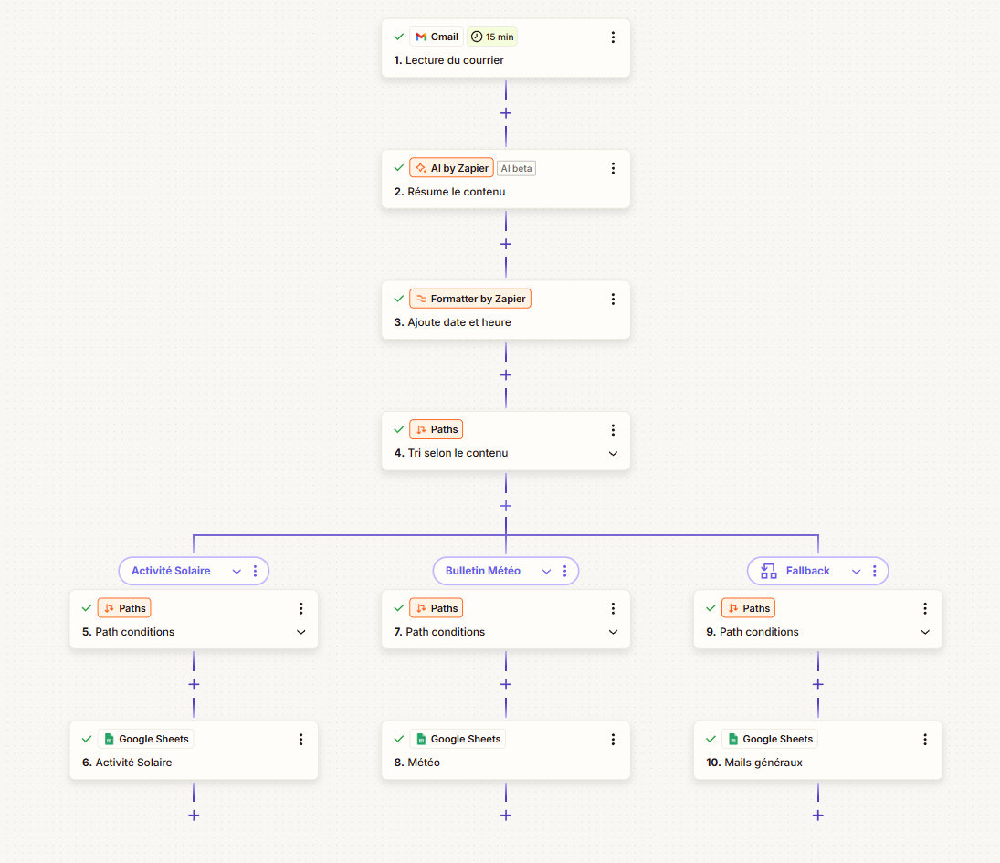
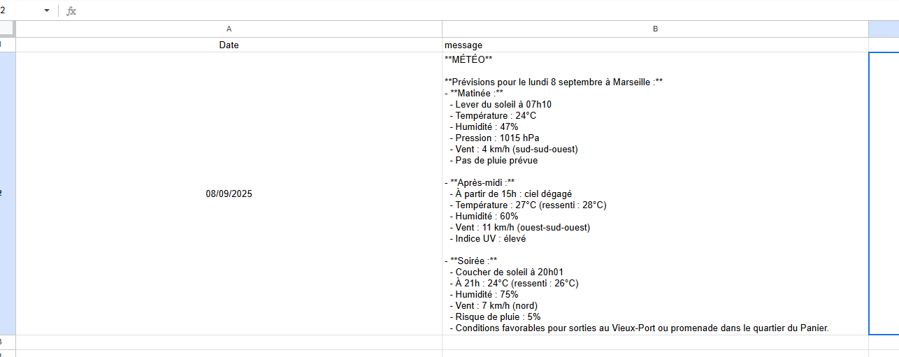
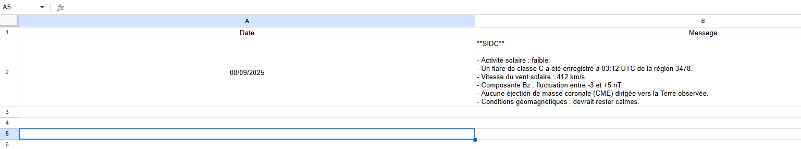
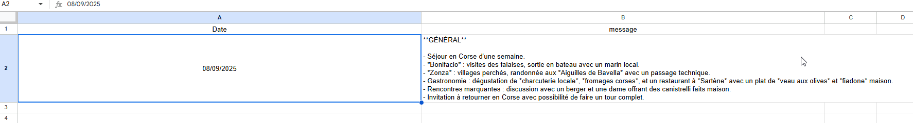
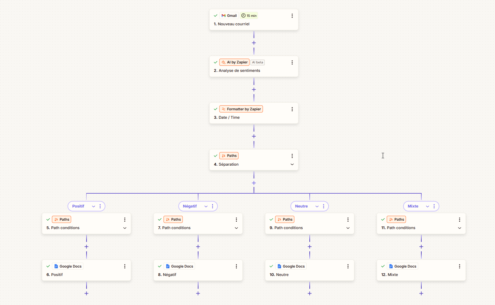
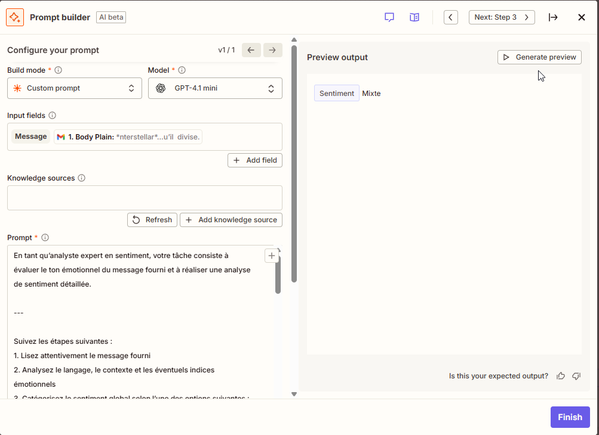
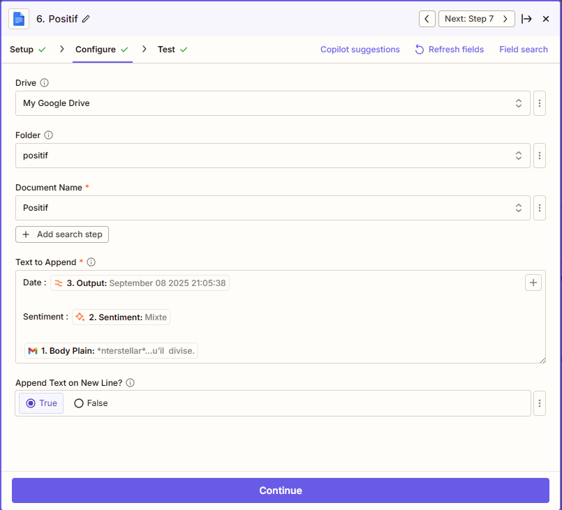
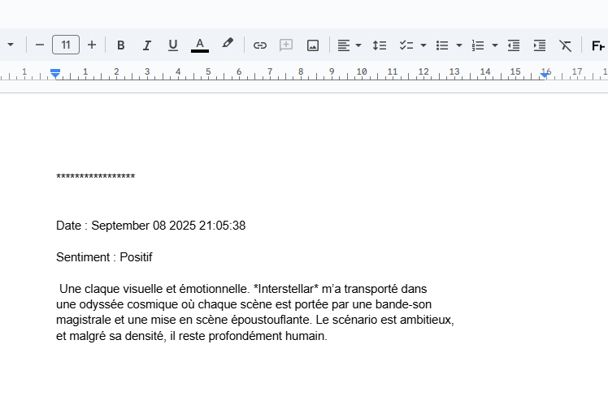

# ⚡ Zapier Showcase – AI-Powered Automations

## Overview

This repository is a Zapier skills showcase: two simple workflows (email summarization & classification, sentiment analysis) demonstrate my ability to use Zapier with AI integrations and Google Workspace.
It is not a production project, but a demonstration designed to highlight my automation skills. 

---

## 🔹 Workflow 1 – Email Sorting & Summarization → Google Sheets



- **Trigger**: new email (Gmail).  
- **AI**: summarization (Zapier AI).  
- **Formatter**: add date & time.  
- **Classification (Paths)**:  
  - Weather bulletin,  
  - Solar activity (SIDC),  
  - General messages.  
- **Output**: insert summary into the corresponding Google Sheet.  

### Sample outputs
-   
-   
-   

---

## 🔹 Workflow 2 – Sentiment Analysis → Google Docs



- **Trigger**: new email (Gmail).  
- **AI**: sentiment analysis (Positive, Negative, Neutral, Mixed).  
- **Formatter**: add date & time.  
- **Classification (Paths)**: each category routes to a dedicated document.  
- **Output**: insert into the corresponding Google Doc, including Date + Sentiment label + Original text.  

### Node setup examples
-   
-   

### Render example
-   

---

## 💾 Repository structure

```
zapier_showcase/
├── README.md                          # French version
├── README_en.md                       # English version
│
├── analyse_sentiments/                # Sentiment analysis workflow
│   ├── node_google_doc.png            # Google Docs node setup
│   ├── node_IA.png                    # AI node setup
│   ├── rendu.png                      # Example of classified text
│   ├── workflow.png                   # Workflow overview
│   └── system_prompt.txt              # AI node system prompt
│
└── tri_resume/                        # Email sorting & summarization workflow
    ├── meteo.png                      # Weather output example
    ├── vacances.png                   # Vacation output example
    ├── SIDC.png                       # Solar activity output example
    ├── node_IA.png                    # AI node setup
    ├── node_google_sheet.png          # Google Sheets node setup
    ├── workflow.png                   # Workflow overview
    └── system_prompt.txt              # AI node system prompt
```

---

👉 Blueprints are not included (limitation of the trial version of Zapier), but **screenshots and prompts** make it possible to reproduce each step.
